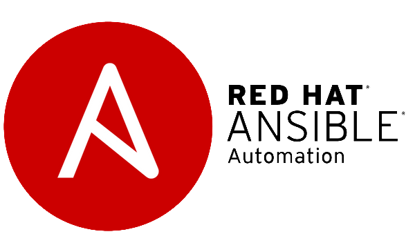
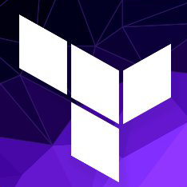

.png)
### Hi there 👋 , I'm Shantanu. 
<!-- MyName -->
<h1>Shantanu Unde</h1>

<!-- Contact Information -->
<ul>
  <!-- <li>Email: <a href="mailto:MyEmail@Address">MyEmail@Address</a></li> -->
  <li> <a href="www.linkedin.com/in/shantanu-unde">LinkedIn Profile</a></li>
  <li> <a href="www.github.com/shantanu789">GitHub Profile</a></li>
</ul>

<!-- Objective -->
<h2>Objective</h2>

  As a DevOps Engineer with 6.6 years of hands-on experience in Configuration Management, Build & Release Management, and CI/CD automation. Seeking an opportunity at a prestigious company to leverage my expertise in managing Kubernetes environments, containerization, and infrastructure security.

<!-- Summary of Qualifications -->
<h2>Summary of Qualifications</h2>
<ul>
  <li>Proficient in Jenkins for CI/CD automation, with extensive experience in Jenkins Pipelines & Releases.</li>
  <li>Skilled in working with diverse tech stacks within Microservices architecture.</li>
  <li>Strong knowledge of AWS services including EC2, ECS, S3, VPC, RDS, and Cloudfront, EKS.</li>
  <li>Expertise in Docker containerization and Kubernetes management.</li>
  <li>Proficient in Helm charts for automated release deployment.</li>
  <li>Experienced with monitoring tools such as Prometheus and Grafana.</li>
  <li>Log aggregation expertise using ELK stack.</li>
  <!-- Add more qualifications here -->
</ul>

<!-- Technical Skills -->
<h2>Technical Skills</h2>
<ul>
  <li>Operating Systems: Linux </li>
  <li>Version Control Tools: Git , GitHub , Azure DevOps </li>
  <li>Build Tools: Maven , NodeJS , Python </li>
  <li>CI/CD Tools: Jenkins , Azure Pipelines </li>
  <li>Configuration Management Tools: Ansible </li>
  <li>Monitoring Tools: ELK , Prometheus , Grafana </li> 
  <li>Cloud Platforms: AWS , GCP </li> 
  <li>Scripting Languages: Shell Bash </li>
  <li>IaC Tools: Terraform </li>
  <li>Containerization: Docker  , Kubernetes </li>
</ul>

<!-- Experience -->
<h2>Experience</h2>

<!-- Senior Analyst | DevOps Engineer | NetEnrich Technologies Pvt Ltd -->
<h3>Senior Analyst | DevOps Engineer | SRE | NetEnrich Technologies Pvt Ltd, Hyderabad | February 2019 - Present</h3>

<!-- Project Experience: Resolution Intelligence Cloud -->
<h4>Project Experience: Resolution Intelligence Cloud (Aug 2023 - Present)</h4>
<ul>
  <li>Domain: Security and Digital Operations (SecOps and DigitalOps)</li>
  <li>Role: Senior Analyst | DevOps Engineer</li>
  <!-- Add project details here -->
</ul>

<!-- Client: Disney Interactive -->
<h4>Client: Disney Interactive (Feb 2019 - Aug 2023)</h4>
<ul>
  <li>Domain: Ecommerce and Media Networks</li>
  <li>Role: Associate..Senior Analyst | DevOps Engineer</li>
  <!-- Add project details here -->
  <!-- Use icons for DevOps, Agile Methodology, CI/CD, IaC, AWS, etc. -->
</ul>

<!-- Education -->
<h2>Education</h2>

  B.E. (Computer Science) | MIT Academy of Engineering, Pune | 2016

<!-- Certifications -->
<h2>Certifications</h2>
<ul>
  <li>Red Hat Certified Engineer (RHEL 7 and RHEL 8, Ansible 2.8)  </li>
  <li>Red Hat Certified Administrator (RHEL 7) </li>
  <li>Red Hat Certified OpenShift Administrator v4.10 (RHEL 8) </li>
  <li>AWS Certified Cloud Practitioner </li>
</ul>

<!--
**shantanu789/shantanu789** is a ✨ _special_ ✨ repository because its `README.md` (this file) appears on your GitHub profile.

Here are some ideas to get you started:

- 🔭 I’m currently working on ...A project in DevOps
- 🌱 I’m currently learning ... Kuberneted with monitoring
- 👯 I’m looking to collaborate on ... Learning DevOps new technologies
- 🤔 I’m looking for help with ... Kafka
- 💬 Ask me about ... Linux, Shell Scripting, Jenkins, Ansible and much more
- 📫 How to reach me: ... www.linkedin.com/in/shantanu-u-8b0117146
- 😄 Pronouns: ... Shan-ta-nu
- ⚡ Fun fact: ... Professional life becoming funny 😅. 
-->
